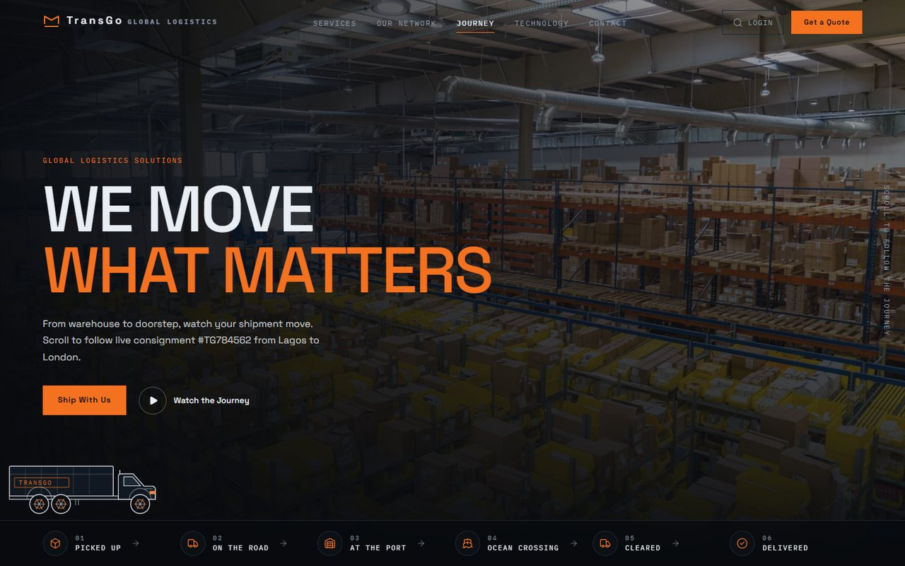
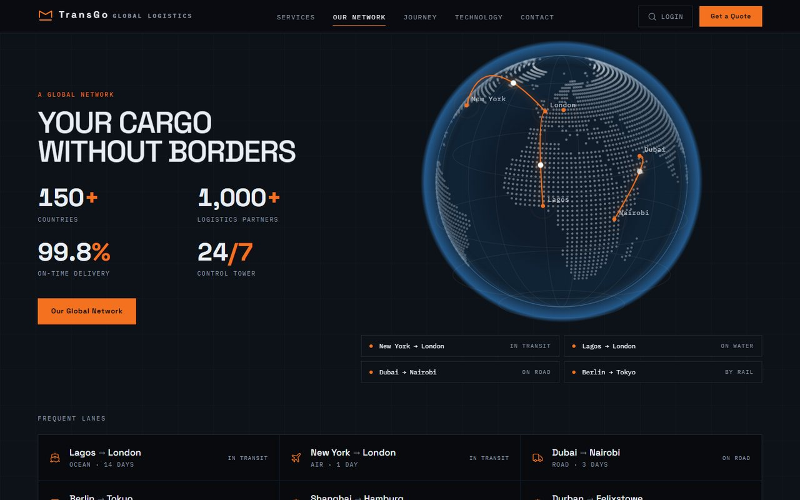
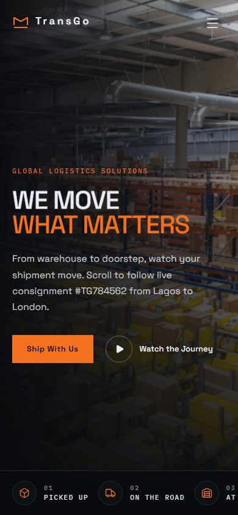

# TransGo Global Logistics

A shipment you can watch move. The page follows one consignment from the warehouse shelf to the front door, one stage per scroll. React 19 + TypeScript + Vite, Tailwind CSS v4, Framer Motion, Lucide icons.

**Live:** https://transgo-logistics.vercel.app



> The working folder is named `meridian-freight` from an earlier draft; the brand, the Vercel project and this repo are all TransGo.

```bash
npm install
npm run dev      # http://localhost:5173
npm run build    # production build in dist/
```

## The journey

`src/sections/` in scroll order: `Hero` → `JourneyIntro` → `StageWarehouse` → `StageRoad` → `StagePort` → `StageOcean` → `StageCustoms` → `StageLastMile` → `Tracking` → `Services` → `Network` → `Technology` → `FinalCTA`.

Each stage pins itself through `StageShell`, which draws the placard and telemetry while the vehicle moves across the frame. `TrackerHUD` follows along, advancing the shipment status as each stage enters the viewport, and hides itself outside the journey.

## Structure

- `src/vehicles/` — the trucks, cranes, ships and planes are hand-built SVG components (`Road`, `Yard`, `SeaAir`), animated rather than drawn as images, so they stay sharp and weigh almost nothing.
- `src/components/` — `Navbar`, `StageShell`, `TrackerHUD`, `Globe` (orthographic projection with cargo dots travelling the arcs via `offsetPath`), `QuoteDrawer`, `Img`, `SplitLines`, `Reveal`, `Footer`.
- `src/data/content.ts` — stages, services, network nodes and all copy. `worldDots.ts` is a pre-computed land-dot grid generated offline, so no map library ships to the browser.
- `src/hooks/` — `useSectionProgress`, `useCountUp`, `useMediaQuery`.
- `src/lib/` — `image.ts` (Unsplash CDN URLs + `srcset`), `ui.ts` (easing, scroll helpers, quote-drawer state).
- Design tokens live in the `@theme` block of `src/index.css` — Tailwind v4, so there is no `tailwind.config.js`.

## Notes

`useSectionProgress` wraps `useScroll` in an identity `useTransform`, which keeps Framer from handing scroll-linked values to the browser's native ScrollTimeline where multi-stop ranges desync.

Stage content is padded left on extra-large screens so the pinned tracker HUD never covers it. Motion respects `prefers-reduced-motion` through `MotionConfig reducedMotion="user"`.

Images are served from the Unsplash CDN with a blurred low-quality placeholder behind each one; swap the photo ids in `content.ts` for the client's own photography before launch.

## Screens

| The global network | On a phone |
| --- | --- |
|  |  |
